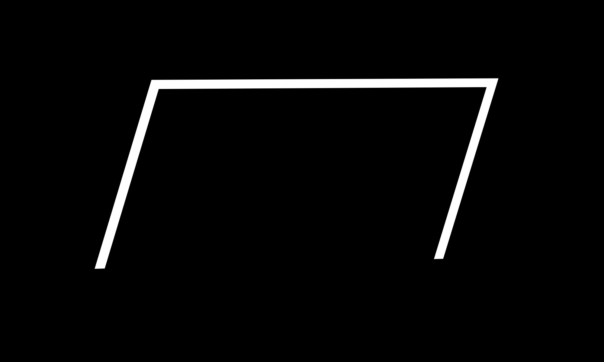
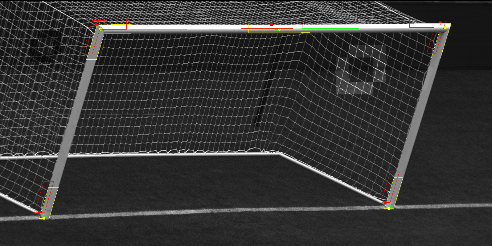
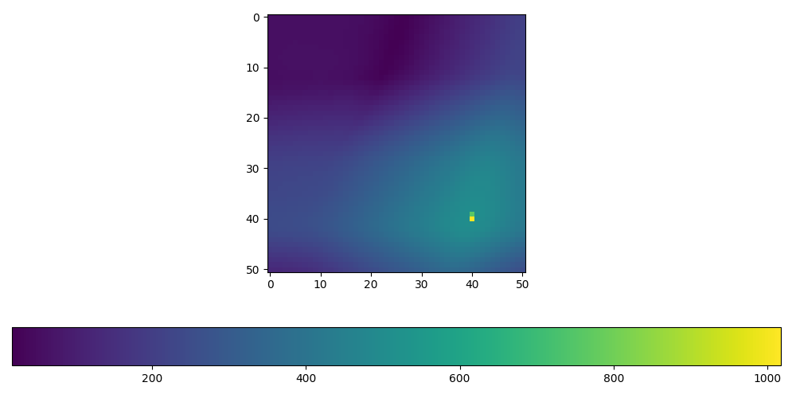
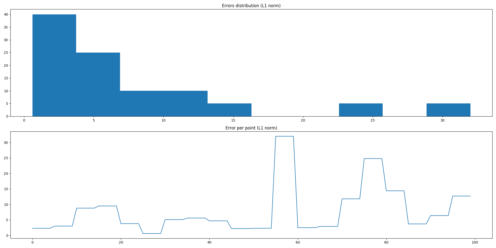

# Goalposts Locator

Locates goalposts key points given approximate position of key points

# Building

The tool uses CMake and OpenCV so they need to be installed.

Once they are installed:

1. Create build folder and cd into it
2. run `cmake <top repo dir>`
3. run `make`

# Running

Launch using the following cmd: 

```
usage: ./goalposts <images-dir> <approximate-points-dir> <exact-points-dir> <num-images> <output-dir> <algorithm-name>
    <algorithm-name>: v1|full-match
```

# Algorithm

Goalposts are located using pattern matching.

First a geometry of goalposts is derived from approximate points by generation of goals pattern and projecting it into plane of image.



### algorithm 'v1'

For each point pattern matching is used to find a position that leads to the best "difference" between masked area in pattern and non-masked with pixel accuracy.

Different metric were tried, absolute difference of means of regions was the best.

### algorithm 'full-match'

Development of `v1` algo. Uses the fact that all points are shifted by the same value so matching is performed for all points all together and distortion is calculated cummulatevely for each displacemnet (all points contribute to the same displacement). Can be though as matching whole pattern in the image but saves up caclulations by reducing "pattern area" using only corners.



Legend: 

* red - approximations
* green - exact
* yellow - found points / patterns

For every point this heatmap of metric is calculated and maximum is seek.



# Notes

1. Markups for all images from the assignment can be found in [](./images/markups) folder.
2. Images preprocessing like gaussian blur, morphological openning or contrast normalisation didn't improve results.
3. Crossbar middlepoint particularities are not taken into account as well as it's sagging. Since it is not a corner it works worst and mainly errors come from the crossbar middlepoint estimation.
4. Goalposts width and height as well as bar width is used in the algo and currently hardcoded but separated in the codebase and have clear interface, so can be easily parametrised (just need to pass through from cmd line/config).


# Improvements

1. Use 3d model of goalposts before projection, that would lead to finer pattern, since for some angles / planes persective distortions are significant, say, bars width varies or pattern vanishes, like in [im0014](images/0014.png).
2. Find better metric / use a feature descriptor like HoG
3. Use gradient search
4. Take into account sagging and crossbar middle point.

# Errors Plots

.

Error per experiment and histogram.

.

Error per point.
